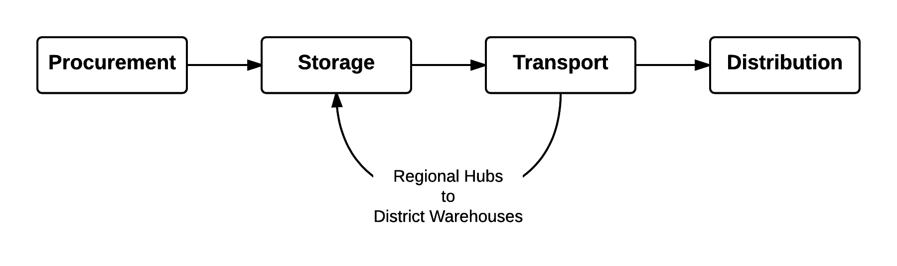

```{r, echo=FALSE, message=FALSE}
library(knitr)
library(knitcitations)
library(RefManageR)

cleanbib()

cite_options(style="markdown")

# bibBirthData <- bibentry(bibtype="Misc",
#                          author=person(family="HHS"),
#                          publisher="United States Department of Health and Human Services (US DHHS), Centers for Disease Control and Prevention (CDC), National Center for Health Statistics (NCHS), Division of Vital Statistics",
#                          title="Natality public-use data 2007-2014 on CDC WONDER Online Database",
#                          year=2016,
#                          month="February",
#                          url="http://wonder.cdc.gov/natality-current.html")


bibBastianEtAl <- bibentry(bibtype="Article",
                 title="Multi-criteria logistics modeling for military humanitarian assistance and disaster relief aerial delivery operations",
                 author=personList(person(family="Bastian", given="Nathaniel"),
                                   person(family="Griffin", given="Paul"),
                                   person(family="Spero", given="Eric"),
                                   person(family="Fulton", given="Lawrence")),
                 publisher="Springer Berlin Heidelberg",
                 journal="Optimization Letters",
                 year=2015,
                 doi="10.1007/s11590-015-0888-1")

bibOzdamarEtAl <- bibentry(bibtype="Article",
                 title="Emergency Logistics Planning in Natural Disasters",
                 author=personList(person(family="Ozdamar", given="Linet"),
                                   person(family="Ekinci", given="Ediz"),
                                   person(family="Kucukyazici", given="Beste")),
                 publisher="Kluwer Academic Publishers",
                 journal="Annals of Operations Research",
                 year=2004)

bibHdxWeb <- bibentry(bibtype="Misc",
                      author=person(family="United Nations Secretariat"),
                      title="Humanitarian Data Exchange",
                      publisher="United Nations Office for the Coordination of Humanitarian Affairs",
                      year=2016,
                      url="https://data.hdx.rwlabs.org/")

bibCREDWeb <- bibentry(bibtype="Misc",
                      author=person(family="EM-Dat"),
                      title="International Disaster Database",
                      publisher="Centre for Research on the Epidemiology of Disasters",
                      year=2016,
                      url="http://www.emdat.be/advanced_search/index.html")

  
```
# Problem Statement & Research Questions

Disasters can be defined as crises that overwhelm, at least for a time, people’s capacities to manage and cope. Under emergency contexts, the ability to plan and move goods and materials is strained. Supply chain systems generally work best in established response scenarios where suppliers, transportation systems, customs situations and the like are in place and stable. However in most emergency responses new suppliers may need to be found, transportation networks may be compromised by the emergency and customs regulations are often in flux during these times. 

Planning for disaster relief scenarios can thus be seen as challenging. Humanitarian agencies, constrained by funding and capacity will often need to make difficult decisions. How best should resources be applied to enable effective responses to disasters while still having the monetary resources to do the job? Historical records can be useful to understand a range of possible answers, but this raises more questions. How many supplies should be pre-positioned in anticipation of a future disaster? What type of supplies should be stocked and where? Some of these questions are considered in the literature reviewed for this proposal, however it is clear that modelling the nuances of the humanitarian logistic chain (HLC) is still an area underserved by academic inquiry. As such, we will contribute to the field by applying simulation techniques to the problem of humanitarian logistics.

# Statement of Objectives

The HLC entails a complex mix of supplier relations for procurement; international storage of supplies at global or regional hubs; international transportation; in-country arrival procedures, taxes, graft and custom clearance; in-country storage and transportation; fraud, theft and spoilage; and ultimately, distribution to affected communities. 

Modelling all of these scenarios is a complex task and for the purposes of this study, we are constrained to simplifying the process to consider key components of the humanitarian logistics chain. We expect to model activities associated with the following components:




The *system* being modelled will include these key aspects of the HLC associated with a single disaster across multiple locations within a country.  We plan to use a combination of R and Simio to develop and execute a simulation model in order understand the behaviour of an HLC system under various entity attributes and event properties as described in the following sections. 

## Entities

The following entities and attributes may be considered in the simulation model:

- Supplier with *attributes* one-time seller (less reliable in terms of meeting requested supplies) or supply chain partner (more reliable)

- Warehouse with *attributes* distance from distribution site, fixed cost, storage capacity, probability of theft

- Transportation modalities with *attributes* speed, capacity, fixed and variable costs (e.g per trip)

- Distribution site with *attributes* accessibility to site (likely, unlikely), subject to over or under capacity (more or less beneficiaries showed up than planned for), subject to hostile theft of supplies (high, low).

## Events

Events may include the occurrence of disasters, theft of supplies, and arrival of supplies at warehouse locations. We anticipate other events may be identified during the project.

# Data Set(s)

Disaster profiles from 1900 to 2015 can be accessed from the Centre for Research on the Epidemiology of Disasters `r citep(bibCREDWeb)`. These data will be used to profile the probability distribution of disasters regionally. We will leverage this information when simulating disaster occurrences that will demand the movement of relief supplies. The Humanitarian Data Exchange provides many different data sets which could be beneficial for this project `r citep(bibHdxWeb)`. Additionally, certain probability distributions may be developed to augment the simulation (such as probability of theft).

# Recent Journal Papers

## Multi-criteria logistic modeling for miliary humanitarian assistance...

This paper describes a model complete with objective function and an array of constraints for aiding in decision support for humanitarian assistance and disaster relief (HA/DR) efforts. Specifically, the model aims to determine the optimal aerial supply chain network for HA/DR given target goals for response time, supply chain cost and unmet demand in the disaster zone `r citep(bibBastianEtAl)`.

## Emergency Logistics Planning in Natural Disasters

This paper describes a model for delivering disaster relief via multiple transportation methods `r citep(bibOzdamarEtAl)`. The model focuses on minimizing demand for various disaster relief commodities at various disaster locations, while considering an array of constraints. The model considers a disaster that encompasses a region which includes the supply depots whereby a given delivery of disaster relief to one location might simultaneously be a pickup of disaster relief destined for another location in the same disaster. 

# Evaluation

The goal in a well functioning HLC is to deliver the right materials, in the right place, in the right time, to the right people according to an objective that meets the least total cost (LTC). In order to evaluate our model, the simulation will be executed over several iterations with various inputs and parameter values. The outputs, such as total cost, and time to deliver relief aid, for each iteration, will be recorded and compared.

# References

```{r, results='asis', echo=FALSE}
BibOptions(style="html", bib.style="authortitle")
bibliography()
```

